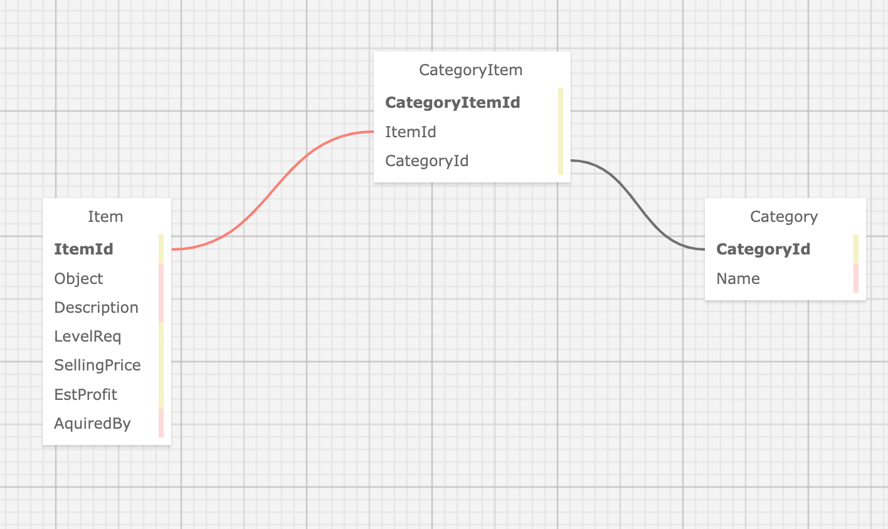
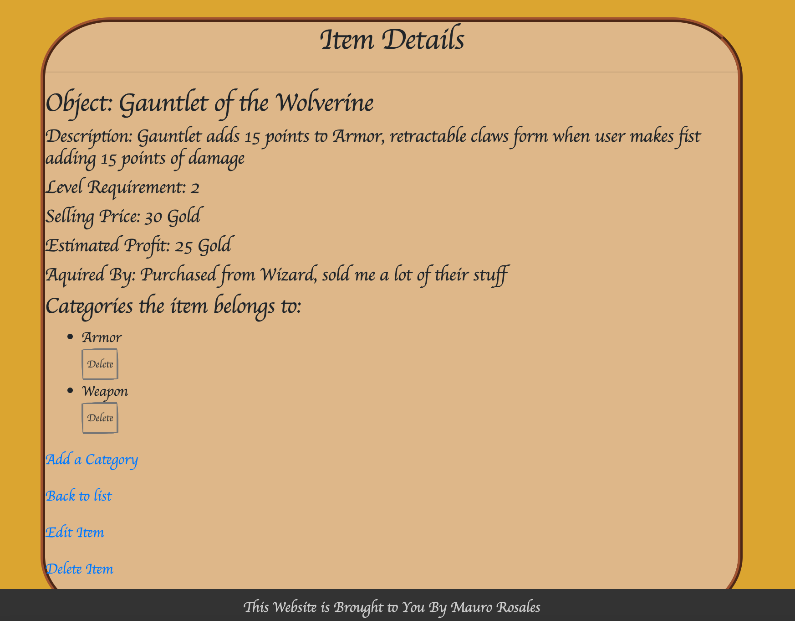

# Ye Olde Inventory Database

#### By Mauro Rosales jr

#### enables user to create a fantasy rpg shop inventory

## Technologies Used

* SQL
* MySQL
* VSCode
* C#
* HTML
* CSS
* Entity Framework

## Description

Enables user to create a shop inventory and categorizes the items 

## Setup/Installation Requirements

* clone repo from https://github.com/maurorosalesjr/YeOldeInvMany
* in terminal type : dotnet restore
* in terminal type : dotnet build
* in terminal type : dotnet run
* use links to create and build out database

## Sample

## Known Bugs

* CSS styling doesnt always load properly

## License

open source

for any questions or comments email me here: mauro.rosales247@gmail.com

Copyright (c) August 2022, Mauro Rosales Jr